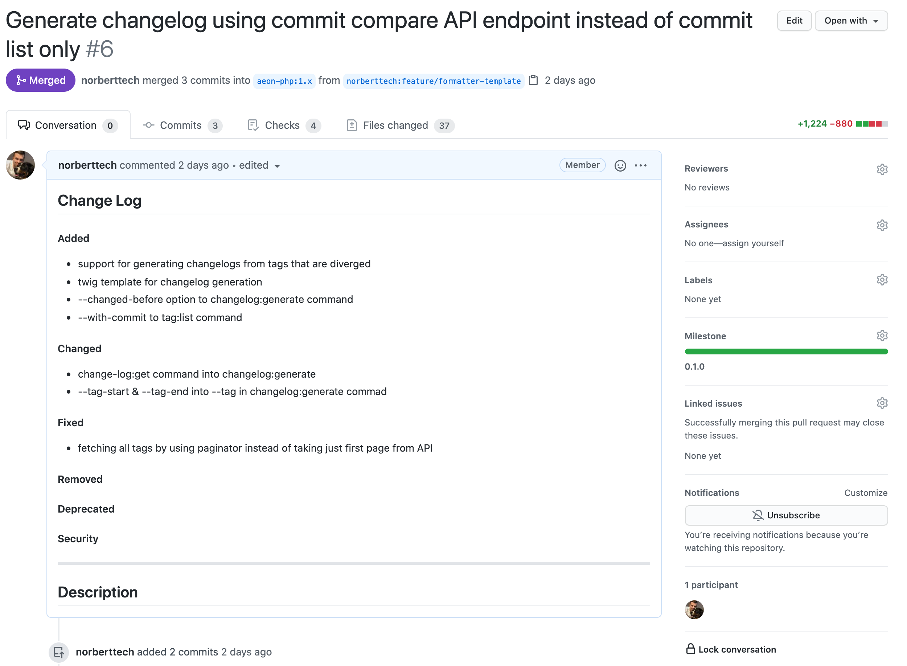

# Automation 

Command Line Application that can automatically update changelog file of your project after each commit/pull request/tag/release  

Table of contents: 

* [Why?](#why)
* [When?](#when)
* [How?](#how)
* [Installation](#installation)
* [Contributing](#contributing)
* [Documentation](#documentation)
* Integrations
  * [GitHub Actions](docs/github_actions.md)
* [Integration Request](#integration-request)

## Why? 

There are similar, more popular projects around, why this? Automation is designed to give project owner a bit more
flexibility and control over the changelog generation process. If pull requests are properly described Automation
will take that description, parse it and extract following types of changes from it: 

* added
* changed
* fixed
* removed
* deprecated
* security 

Those types are part of [keep a changelog](https://keepachangelog.com/en/1.0.0/) notation. 

Pull Request Description by definition is easy to update/change, also once commits are merged which makes it really easy
to get back to a specific PR when generating a changelog, fix it and get a better changelog output. 

What if pull requests does not have expected description? Then Automation will fall back into commit messages but even here it will
first try to look for [conventional commit](https://www.conventionalcommits.org/) notation and if that fail it will look for common prefixes
like `Fix`, `Added`, `Removed`.

Still not convinced by keep a changelog theme? No problem, Automation is supporting also more classical approach, just use `--theme=classic` option. 

What if one would still prefer commit messages over pull requests? Don't worry, `--only-commits` option is here for him, just like `--only-pull-requests` is for the opposite camp. 


### Turn This



### Into This 


## When? 

Not sure if automated changelog generation is for you? 

* Software with stable release cycle, following SemVer 
* Continuous Integration and Continuous Delivery (CI/CD)

Thos are two most popular use cases.
 
Releasing open source project you will probably look into `--tag` option that will take a all changes between given and previous tag and generate changelog. 

When working on a project that is released multiple times every day and does not really have a predictable release cycle you might want to store last deployed commit SHA hash and pass it later through `--commit-end` option. Automation will be able then to generate changelog since last release for you. 

## How? 

Examples: 

Generate full changelog for repository

```
docker run -t -e AEON_AUTOMATION_GH_TOKEN --rm aeonphp/automation gh:changelog:generate:all aeon-php/calendar --skip-from="dependabot[bot]" --skip-from="aeon-automation"
```

Generate full changelog for repository ⚠️ **update CHANGELOG.md file and all releases** ⚠️

```
docker run -t -e AEON_AUTOMATION_GH_TOKEN --rm aeonphp/automation gh:changelog:generate:all aeon-php/calendar --github-release-update --github-file-update-path=CHANGELOG.md --skip-from="dependabot[bot]" --skip-from="aeon-automation"
```

Generate unreleased changes for repository

```
docker run -t -e AEON_AUTOMATION_GH_TOKEN --rm aeonphp/automation gh:changelog:generate aeon-php/calendar --skip-from="dependabot[bot]" --skip-from="aeon-automation"
```

Generate changelog for specific tag

```
docker run -t -e AEON_AUTOMATION_GH_TOKEN --rm aeonphp/automation gh:changelog:generate aeon-php/calendar --tag=0.15.0 --skip-from="dependabot[bot]" --skip-from="aeon-automation"
```

In order to generate a changelog Automation takes 4 steps. 

> Currently, Automation takes the whole project history directly from GitHub but more sources are coming. 

### 1) Detect Changes Scope 

When generating a changelog, Automation is first trying to understand what is the scope of changes. By default, it takes head of the default branch and it looks for the latest tag (from a semantic versioning point of view). Of course, this can be overwritten by telling automation to start from a specific tag using `--tag` option or even more precisely by providing start and end commit SHA, `--commit-start`, `--commit-end`. 

There are 2 more options that could help to setup the right scope, `--changed-after` and `--changed-before` which also supports relative formats like `--changed-after=noon` or `--changed-after="-1 day"` 

### 2) Fetch Project History 

When the scope is detected, Automation will fetch the history of changes from source. It all starts from commits, and it works pretty much as `git log origin..HEAD` command. When commits are fetched, Automation pulls all Pull Requests since they also have valuable data about changes (this can be skipped using `--only-commits` option).
Not all contributions are worth mentioning, sometimes you might want to exclude changes from bots. `--skip-from` option makes possible to skip changes from given authors. 

### 3) Analyze Project History 

Automation follows the [Keep a Changelog](https://keepachangelog.com/en/1.0.0/) philosophy and it can recognize following types of changes:  

* Added 
* Changed 
* Deprecated 
* Removed 
* Fixed 
* Security 

There are several strategies making this recognition possible: 

* [HTML Changes Detector](src/Aeon/Automation/Changes/Detector/HTMLChangesDetector.php) 
* [Conventional Commit Detector](src/Aeon/Automation/Changes/Detector/ConventionalCommitDetector.php) 
* [Prefix Detector](src/Aeon/Automation/Changes/Detector/PrefixDetector.php) 
* [Default Detector](src/Aeon/Automation/Changes/Detector/DefaultDetector.php) 

They are applied in given order until first one parse changes source and properly detect all changes. 

### 4) Format Changelog 

When all changes are detected and grouped by types Automation moves to the last step, changelog generation. 

### Formats 

Automation supports following changelog formats: 

* `markdown` 
* `html` 

### Themes 

Automation supports following themes: 

* `keepachangelog`
* `classic` 

All themes are supported by all formats. 

#### keepachangelog 

This theme follows [Keep a Changelog](https://keepachangelog.com/en/1.0.0/) convention, changes are organized by type. 

#### classic 

This theme does not organize changes in any particular way, each change is displayed as a separated line item ordered by change date. 
Combined with `--only-pull-requests` option will provide clean and organized classical list of changes taken from pull request titles. 

## Installation

Before you start, [generate](https://github.com/settings/tokens) your own GitHub personal access token.
It can be provided as environment variable `AUTOMATION_GH_TOKEN` or through CLI option `--github-token` 

If Automation is not working as you expected, increase verbosity to see how it works under the hood.
It can be done by providing one of following options: 

* `-v` - normal
* `-vv` - verbose
* `-vvv` - debug

### Docker

```
docker pull aeonphp/automation
docker run -t --rm aeonphp/automation --help
```

### Composer 

```
git clone git@github.com:aeon-php/automation.git
cd automation 
composer install
bin/automation --help
```

### Phar 

TODO: Coming soon 

---

Because Automation is using GitHub API to grab project history you can use it against any popular github projects. 

```
automation gh:changelog:generate organization/name -v
```

## Contributing 

Looking for a way to contribute? Awesome ❤️ Below you can find few places to start with:

* [Contributing & Development](https://github.com/aeon-php/.github/blob/master/CONTRIBUTING.md)

You are also more than welcome to open an [issue](https://github.com/aeon-php/automation/issues) if anything about this project bothers you.

## Documentation

### Commands

```bash
aeon-automation

Usage:
  command [options] [arguments]

Options:
  -h, --help                                         Display help for the given command. When no command is given display help for the list command
  -q, --quiet                                        Do not output any message
  -V, --version                                      Display this application version
      --ansi                                         Force ANSI output
      --no-ansi                                      Disable ANSI output
  -n, --no-interaction                               Do not ask any interactive question
      --configuration=CONFIGURATION                  Custom path to the automation.xml configuration file.
      --cache-path=CACHE-PATH                        Path to root cache directory, taken from sys_get_tmp_dir() function or AEON_AUTOMATION_CACHE_DIR env variable [default: "/Users/norzechowicz/.automation"]
      --github-token=GITHUB-TOKEN                    Github personal access token, generated here: https://github.com/settings/tokens By default taken from AEON_AUTOMATION_GH_TOKEN env variable
      --github-enterprise-url=GITHUB-ENTERPRISE-URL  Github enterprise URL, by default taken from AEON_AUTOMATION_GH_ENTERPRISE_URL env variable
  -v|vv|vvv, --verbose                               Increase the verbosity of messages: 1 for normal output, 2 for more verbose output and 3 for debug

Available commands:
  completion                         Dump the shell completion script
  help                               Display help for a command
  list                               List commands
 cache
  cache:clear                        Clears all or specific caches.
 gh
  gh:branch:list                     List GitHub project branches
  gh:changelog:generate              Generate change log for a release.
  gh:changelog:generate:all          Generate change log for all tags.
  gh:changelog:get                   Get project changelog.
  gh:changelog:release:unreleased    Update changelog file by turning Unreleased section into the next release
  gh:milestone:create                Create new milestone for project
  gh:milestone:list                  
  gh:pull-request:description:check  Check if pull request has changes in expected by Automation format.
  gh:pull-request:list               
  gh:pull-request:template:show      Display pull request template required by this tool to properly parse keepachangelog format
  gh:release:list                    List all project releases
  gh:tag:list                        Display all tags following SemVer convention sorted from the latest to oldest
  gh:workflow:job:list               List project Github actions jobs status from the latest workflow run
  gh:workflow:timing:list            List project Github actions workflows billable minutes usage in current billing cycle
```

### gh:changelog:generate

```bash
Description:
  Generate change log for a release.

Usage:
  changelog:generate [options] [--] <project>

Arguments:
  project                                                project name, for example aeon-php/calendar

Options:
      --commit-start=COMMIT-START                        Optional commit sha from which changelog is generated . When not provided, default branch latest commit is taken
      --commit-end=COMMIT-END                            Optional commit sha until which changelog is generated . When not provided, latest tag is taken
      --changed-after=CHANGED-AFTER                      Ignore all changes after given date, relative date formats like "-1 day" are also supported
      --changed-before=CHANGED-BEFORE                    Ignore all changes before given date, relative date formats like "-1 day" are also supported
      --tag=TAG                                          List only changes from given release
      --tag-next=TAG-NEXT                                List only changes until given release
      --tag-only-stable                                  Check SemVer stability of all tags and remove all unstable
      --release-name=RELEASE-NAME                        Name of the release when --tag option is not provided [default: "Unreleased"]
      --only-commits                                     Use only commits to generate changelog
      --only-pull-requests                               Use only pull requests to generate changelog
      --compare-reverse                                  When comparing commits, revers the order and compare start to end, instead end to start.
      --format=FORMAT                                    How to format generated changelog, available formatters: "markdown", "html" [default: "markdown"]
      --theme=THEME                                      Theme of generated changelog: "keepachangelog", "classic" [default: "keepachangelog"]
      --skip-from=SKIP-FROM                              Skip changes from given author|authors (multiple values allowed)
      --github-release-update                            Update GitHub release description if you have right permissions and release exists
      --github-file-update-path=GITHUB-FILE-UPDATE-PATH  Update changelog file directly at GitHub by reading existing file content and changing related release section. For example: --github-file-update-path=CHANGELOG.md
      --github-file-update-ref=GITHUB-FILE-UPDATE-REF    The name of the commit/branch/tag from which to take file for --github-file-update-path=CHANGELOG.md option. Default: the repository’s default branch.
  -h, --help                                             Display help for the given command. When no command is given display help for the list command
  -q, --quiet                                            Do not output any message
  -V, --version                                          Display this application version
      --ansi                                             Force ANSI output
      --no-ansi                                          Disable ANSI output
  -n, --no-interaction                                   Do not ask any interactive question
      --configuration=CONFIGURATION                      Custom path to the automation.xml configuration file.
      --cache-path=CACHE-PATH                            Path to root cache directory, taken from sys_get_tmp_dir() function or AEON_AUTOMATION_CACHE_DIR env variable [default: "/Users/norzechowicz/.automation"]
      --github-token=GITHUB-TOKEN                        Github personal access token, generated here: https://github.com/settings/tokens By default taken from AEON_AUTOMATION_GH_TOKEN env variable
      --github-enterprise-url=GITHUB-ENTERPRISE-URL      Github enterprise URL, by default taken from AEON_AUTOMATION_GH_ENTERPRISE_URL env variable
  -v|vv|vvv, --verbose                                   Increase the verbosity of messages: 1 for normal output, 2 for more verbose output and 3 for debug

Help:
  When no parameters are provided, this command will generate Unreleased change log. Please be careful when using --github-release-update and --github-file-update-path since those options will do changes in project repository.
```

### gh:changelog:generate:all

```bash
Description:
  Generate change log for all tags.

Usage:
  gh:changelog:generate:all [options] [--] <project>

Arguments:
  project                                                project name, for example aeon-php/calendar

Options:
      --tag-start=TAG-START                              Generate changelog from given tag, if not provided it starts from the earliest tag
      --tag-end=TAG-END                                  Generate changelog until given tag, if not provided it ends at the last tag
      --tag-skip=TAG-SKIP                                Skip specific tags (multiple values allowed)
      --tag-only-stable                                  Check SemVer stability of all tags and remove all unstable
      --skip-from=SKIP-FROM                              Skip changes from given author|authors (multiple values allowed)
      --only-commits                                     Use only commits to generate changelog
      --only-pull-requests                               Use only pull requests to generate changelog
      --compare-reverse                                  When comparing commits, revers the order and compare start to end, instead end to start.
      --format=FORMAT                                    How to format generated changelog, available formatters: "markdown", "html" [default: "markdown"]
      --theme=THEME                                      Theme of generated changelog: "keepachangelog", "classic" [default: "keepachangelog"]
      --github-release-update                            Update GitHub release description if you have right permissions and release exists
      --github-file-update-path=GITHUB-FILE-UPDATE-PATH  Update changelog file directly at GitHub by reading existing file content and changing related release section. For example: --github-file-update-path=CHANGELOG.md
      --github-file-update-ref=GITHUB-FILE-UPDATE-REF    The name of the commit/branch/tag from which to take file for --github-file-update-path=CHANGELOG.md option. Default: the repository’s default branch.
  -h, --help                                             Display help for the given command. When no command is given display help for the list command
  -q, --quiet                                            Do not output any message
  -V, --version                                          Display this application version
      --ansi                                             Force ANSI output
      --no-ansi                                          Disable ANSI output
  -n, --no-interaction                                   Do not ask any interactive question
      --configuration=CONFIGURATION                      Custom path to the automation.xml configuration file.
      --cache-path=CACHE-PATH                            Path to root cache directory, taken from sys_get_tmp_dir() function or AEON_AUTOMATION_CACHE_DIR env variable [default: "/Users/norzechowicz/.automation"]
      --github-token=GITHUB-TOKEN                        Github personal access token, generated here: https://github.com/settings/tokens By default taken from AEON_AUTOMATION_GH_TOKEN env variable
      --github-enterprise-url=GITHUB-ENTERPRISE-URL      Github enterprise URL, by default taken from AEON_AUTOMATION_GH_ENTERPRISE_URL env variable
  -v|vv|vvv, --verbose                                   Increase the verbosity of messages: 1 for normal output, 2 for more verbose output and 3 for debug

Help:
  When no parameters are provided, this command will generate changelog for each commit that follows semver semantic.
```

### gh:changelog:release:unreleased

```bash
Description:
  Update changelog file by turning Unreleased section into the next release

Usage:
  gh:changelog:release:unreleased [options] [--] <project> <changelog-file-path> <release-name>

Arguments:
  project                                              project name, for example aeon-php/calendar
  changelog-file-path                                  Path to the changelog file from repository root. For example: CHANGELOG.md
  release-name                                         Name of the next release.

Options:
      --format=FORMAT                                  How to format generated changelog, available formatters: "markdown", "html" [default: "markdown"]
      --theme=THEME                                    Theme of generated changelog: "keepachangelog", "classic" [default: "keepachangelog"]
      --github-release-update                          Update GitHub release description if you have right permissions and release exists
      --github-file-changelog-update                   Update changelog file by pushing commit to GitHub directly
      --github-file-update-ref=GITHUB-FILE-UPDATE-REF  The name of the commit/branch/tag from which to take file for changelog-file-path argument. Default: the repository’s default branch.
  -h, --help                                           Display help for the given command. When no command is given display help for the list command
  -q, --quiet                                          Do not output any message
  -V, --version                                        Display this application version
      --ansi                                           Force ANSI output
      --no-ansi                                        Disable ANSI output
  -n, --no-interaction                                 Do not ask any interactive question
      --configuration=CONFIGURATION                    Custom path to the automation.xml configuration file.
      --cache-path=CACHE-PATH                          Path to root cache directory, taken from sys_get_tmp_dir() function or AEON_AUTOMATION_CACHE_DIR env variable [default: "/Users/norzechowicz/.automation"]
      --github-token=GITHUB-TOKEN                      Github personal access token, generated here: https://github.com/settings/tokens By default taken from AEON_AUTOMATION_GH_TOKEN env variable
      --github-enterprise-url=GITHUB-ENTERPRISE-URL    Github enterprise URL, by default taken from AEON_AUTOMATION_GH_ENTERPRISE_URL env variable
  -v|vv|vvv, --verbose                                 Increase the verbosity of messages: 1 for normal output, 2 for more verbose output and 3 for debug

Help:
  This command only manipulates the changelog file, it does not create new releases.
```

### gh:changelog:get

```bash
Description:
  Get project changelog.

Usage:
  gh:changelog:get [options] [--] <project>

Arguments:
  project                                            project name, for example aeon-php/calendar

Options:
      --github-file-path=GITHUB-FILE-PATH            changelog file path [default: "CHANGELOG.md"]
      --github-file-ref=GITHUB-FILE-REF              The name of the commit/branch/tag from which to take file for --github-file-path=CHANGELOG.md option. Default: the repository’s default branch.
      --sha1-hash                                    Optional display only sha1 hash of the changelog file instead of file content
  -h, --help                                         Display help for the given command. When no command is given display help for the list command
  -q, --quiet                                        Do not output any message
  -V, --version                                      Display this application version
      --ansi                                         Force ANSI output
      --no-ansi                                      Disable ANSI output
  -n, --no-interaction                               Do not ask any interactive question
      --configuration=CONFIGURATION                  Custom path to the automation.xml configuration file.
      --cache-path=CACHE-PATH                        Path to root cache directory, taken from sys_get_tmp_dir() function or AEON_AUTOMATION_CACHE_DIR env variable [default: "/Users/norzechowicz/.automation"]
      --github-token=GITHUB-TOKEN                    Github personal access token, generated here: https://github.com/settings/tokens By default taken from AEON_AUTOMATION_GH_TOKEN env variable
      --github-enterprise-url=GITHUB-ENTERPRISE-URL  Github enterprise URL, by default taken from AEON_AUTOMATION_GH_ENTERPRISE_URL env variable
  -v|vv|vvv, --verbose                               Increase the verbosity of messages: 1 for normal output, 2 for more verbose output and 3 for debug

Help:
  When no parameters are provided, this command will generate Unreleased change log. Please be careful when using --github-release-update and --github-file-update-path since those options will do changes in project repository.
```

### gh:tag:list

```bash
Description:
  Display all tags following SemVer convention sorted from the latest to oldest

Usage:
  gh:tag:list [options] [--] <project>

Arguments:
  project                                            project name

Options:
      --with-date                                    display date when tag was committed
      --with-commit                                  display commit SHA of tag
      --limit=LIMIT                                  Maximum number of tags to get
  -h, --help                                         Display help for the given command. When no command is given display help for the list command
  -q, --quiet                                        Do not output any message
  -V, --version                                      Display this application version
      --ansi                                         Force ANSI output
      --no-ansi                                      Disable ANSI output
  -n, --no-interaction                               Do not ask any interactive question
      --configuration=CONFIGURATION                  Custom path to the automation.xml configuration file.
      --cache-path=CACHE-PATH                        Path to root cache directory, taken from sys_get_tmp_dir() function or AEON_AUTOMATION_CACHE_DIR env variable [default: "/Users/norzechowicz/.automation"]
      --github-token=GITHUB-TOKEN                    Github personal access token, generated here: https://github.com/settings/tokens By default taken from AEON_AUTOMATION_GH_TOKEN env variable
      --github-enterprise-url=GITHUB-ENTERPRISE-URL  Github enterprise URL, by default taken from AEON_AUTOMATION_GH_ENTERPRISE_URL env variable
  -v|vv|vvv, --verbose                               Increase the verbosity of messages: 1 for normal output, 2 for more verbose output and 3 for debug
```

### gh:workflow:timing:list

```
Description:
  List project Github actions workflows billable minutes usage in current billing cycle

Usage:
  gh:workflow:timing:list [options] [--] <project>

Arguments:
  project                                            project name

Options:
      --os=OS                                        Show billable minutes for operating systems [default: ["ubuntu","macos","windows"]] (multiple values allowed)
  -h, --help                                         Display help for the given command. When no command is given display help for the list command
  -q, --quiet                                        Do not output any message
  -V, --version                                      Display this application version
      --ansi                                         Force ANSI output
      --no-ansi                                      Disable ANSI output
  -n, --no-interaction                               Do not ask any interactive question
      --configuration=CONFIGURATION                  Custom path to the automation.xml configuration file.
      --cache-path=CACHE-PATH                        Path to root cache directory, taken from sys_get_tmp_dir() function or AEON_AUTOMATION_CACHE_DIR env variable [default: "/Users/norzechowicz/.automation"]
      --github-token=GITHUB-TOKEN                    Github personal access token, generated here: https://github.com/settings/tokens By default taken from AEON_AUTOMATION_GH_TOKEN env variable
      --github-enterprise-url=GITHUB-ENTERPRISE-URL  Github enterprise URL, by default taken from AEON_AUTOMATION_GH_ENTERPRISE_URL env variable
  -v|vv|vvv, --verbose                               Increase the verbosity of messages: 1 for normal output, 2 for more verbose output and 3 for debug

Help:
  Billable minutes only apply to workflows in private repositories that use GitHub-hosted runners.
```

## Integration Request

If you would lik to integrate Automation with your project but not sure how, feel free to [Open Integration Request](https://github.com/aeon-php/automation/issues/new/choose).  
We will first test your project and if possible prepare an integration Pull Request. 
